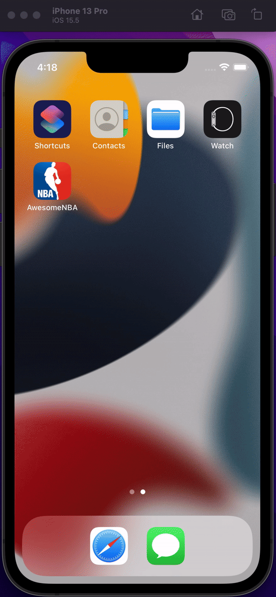
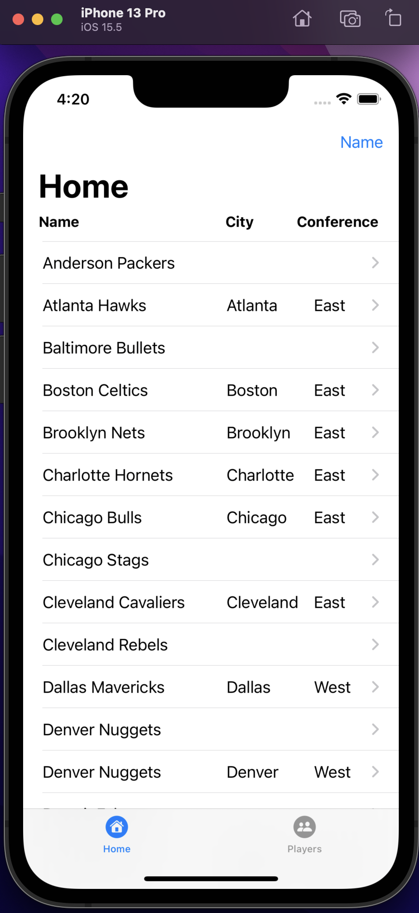

# AwesomeNBA
 
Simple iOS App, done as a test task project for learning purposes in 2024 January.

[Description](#description)

[Implementation](#implementation)

[Demonstration](#demonstration)

## Description:
This App shows to User a list of Data fetched from test API, which inlcudes Network requests and responds.

This Apps helps to User to retrieve NBA Teams list for the current season and navigate accross them. User can view and sort Teams in the list by using provided Sorting options by pressin Sort button in navigation bar. Each screen is done as simple tables with displayed information.

#### This app handles the following actions:

  1. Display the lists of Teams and Players, containing data, when it were successfully retrieved from API.

  2. It is possible to refresh data on each list on native refresh by swiping list down.
  
  3. It is possible to search a Player by his name or surname in implemented native Search field.
  
  4. As agreed UI is simple as it is and focus of this task was not to create the impresive one.

  5. In accordance to Task descripton there is added Alamofire via Swift Package Manager.
 
 
  
## Implementation: 
The App currently consists of two Tab, which has 4 posible states. Below are presented all of them:

1. The __Launchig App__ descriptionBelow:

 

Lorem Ipsum.

 
 

2. The __Teams Screen__ 2descriptionBelow:
  
  

Lorem Ipsum.

 
 

3. The __Players Screen__ 3descriptionBelow:
  
   

Lorem Ipsum.

 
 

4. The __Games state__ 3descriptionBelow:
  
 

Lorem Ipsum.
 
 

## Demonstration: 

1. Feature 1 demonstration:

   
   
2. Feature 2 demonstration:

3. Feature 3 demonstration:

