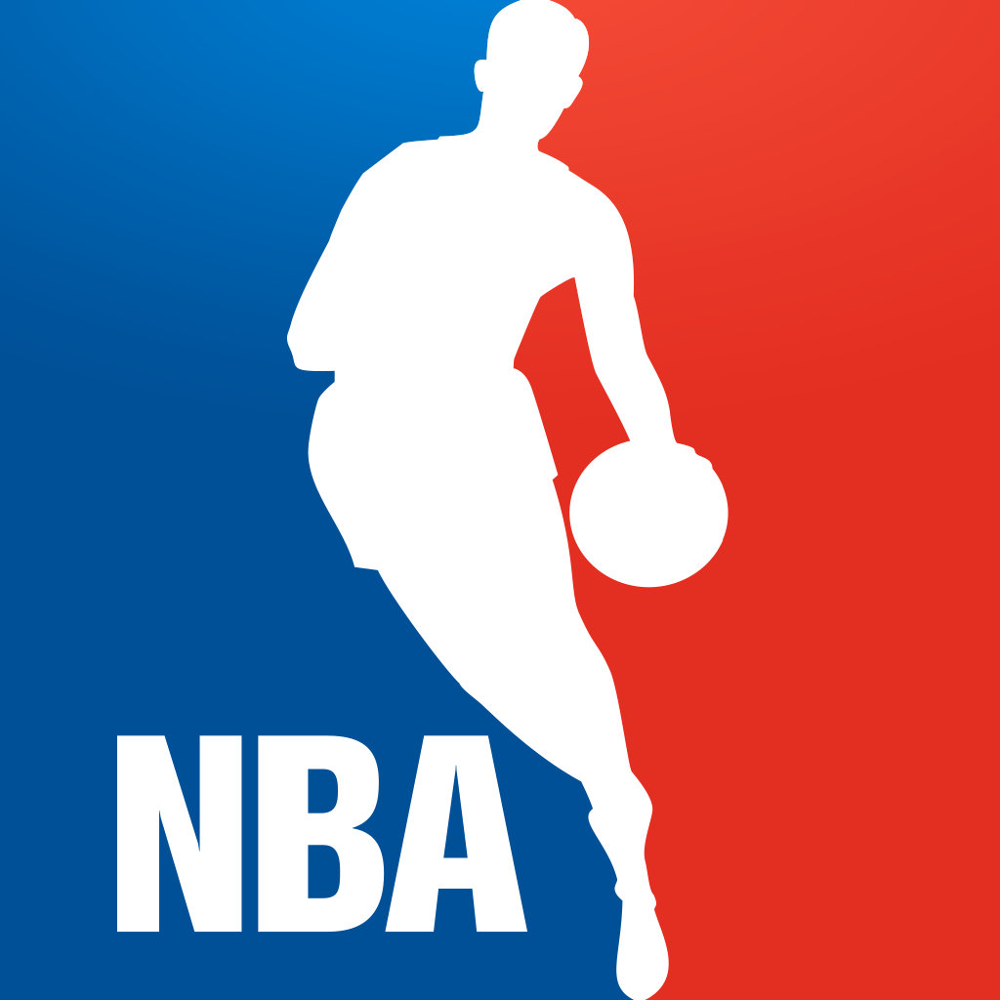

# AwesomeNBA
 
Simple iOS App, done as a test task project for learning purposes in 2024 January.

 

Main Keywords describing used technologies:
 - iOS-15
 - SwiftUI
 - MVVM
 - Alamofire
 - JSON
 - URLSession
 - Sync await
 - TabBar
 - NavigationView

[Description](#description)

[Implementation](#implementation)

[Demonstration](#demonstration)

## Description:
This App shows to User a lists of Data fetched from test API and helps to the User to retrieve Teams list for the current NBA season, navigate accross them, search Player from list and see game scores for choosen Player's team or selected from the list Team. User also can sort Teams in the list by using provided Sorting options by pressing Sort button in the navigation bar.

Screen structure consist of two tabs (used `TabBar`), two pushable views and a sheet. For navigation it was used `NavigationView` and `NavigationLink`.

#### This app handles these following actions:

  1. Display the lists of Teams, Players, Games containing data, when it were successfully retrieved from API;

  2. It is possible to refresh data on each list on native iOS refresh action by swiping list down;

  3. It is possible to search a Player by his name or surname in the provided native Search field;

  5. Sorting of Team is availbale by presing on sort button. Currently have been implemented 3 sort option:
       - Sorting by Name
       - Sorting by City
       - Sorting by Conference

#### Disclaimers:

  1. As agreed by task description UI is simple as it is. The main focus of this project was practical implementation of work with REST API and navigation between different screens;
    
  2. There are no loading screens, empty state screens or network failure showing sceens;

  3. All possible Network Error handled as simple as posible, with simple prints into XCode console;

  4. In accordance to Task descripton there is added Alamofire via Swift Package Manager. It is included only for demonstrational reasons and for real project depending on it's need it would concedered one common consistive aproach to work with Network requests;
   
  5. There are no Unit or UI tests included, due this project is not focusing on that. But here was used Dependency Ijection and no Singletons so app project's structure is basically ready for adding tests. It could be done easily on separate request.
 
 
  
## Implementation: 

0. The __App Icon__ and __App Title__:
1. 
 
 

2. The __Launchig App__ - previews loading screen before initializing the App:

  
 
 

The App currently consists of two Tabs and 4 Screens in total. Below are presented all of them:

2. The __Teams Screen__ shows available Teams:
  
  

List the data with Teams from current season. There few teams with missing City or Conference properties, but it it does not destrubs to sort and view all teams. API call logic conciders pagination, so all available teams from all existing pages will be retrivied and shown. Here is considered that it is agreement with Back End, that amount of pages will not be huge, so it is allowed to fetch all data per time.

 
 

3. The __Players Screen__ Shows all available Players:
  
   

Lorem Ipsum.

 
 

4. The __Games Screen__ Shows all available Games for selected Team:
  
 

When in the Home page Tab, a User should be able to select a Team to view recent Games. User can get back from this screen using Back button.
 
 

## Demonstration: 

1. The `Navigation` is implemented between tabs and next screens are available by choosing relevant row:

   
   
2. The `Sort` feature is implemented for sorting Teams:

3. The `Search` feature is implemented for selecting Players:

